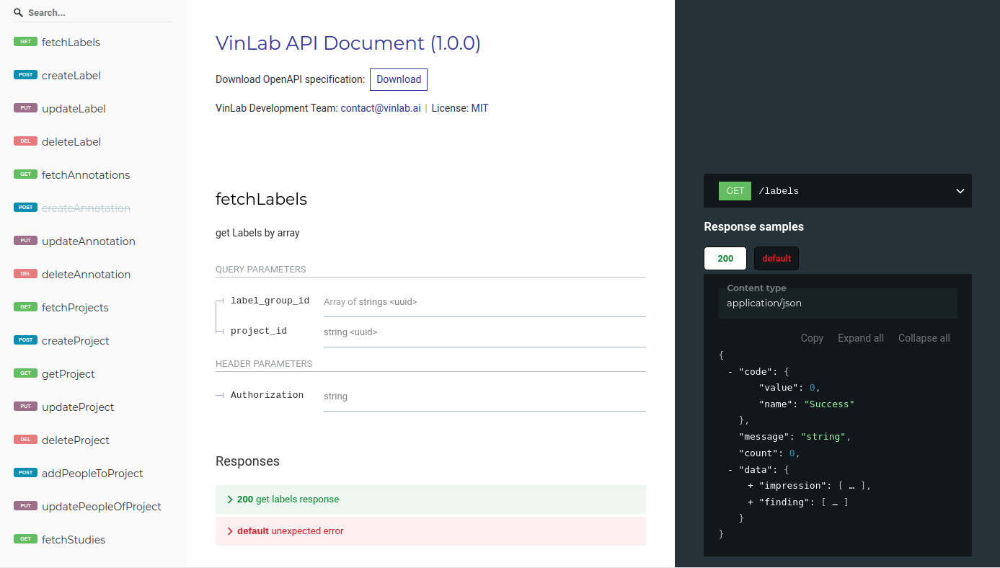

# VinDr Lab / API

VinDr Lab API is a part of the VinLab project. Which performs as the middleware layer between user interface and backend systems.

## What does this project do?

We guess some of you guys will ask why don’t we combine the upload part into this API. This is simple, Golang can not modify attributes in the DICOM file now, even though Python can do it easily.

## Project tree

```
.
├── account/ // account management
├── annotation/ // including business process for annotations and labels
├── api-doc.yml
├── conf/ // configuration files and permission definitions
├── constants/ // some constants for project
├── Dockerfile
├── entities/ // entities definition
├── gen-api-doc.sh
├── helper/ // side-kick component, connect to other service
├── images/
├── keycloak/ // supported library for Keycloak
├── label_group/ // handle request for label_group
├── LICENSE.md
├── main.go // the leading actor
├── mappings/ // some maps for document's attributes
├── mw/ // mid-layer used for authorizing and validating coming requests
├── object/ //handle business for object
├── project/ // handler for project
├── README.md
├── redoc-static.html
├── session/ // session controller for dashboard - viewer
├── stats/ // provide stats and some high-computation-work-load result
├── study/ // process business for study and task objects
├── templates/ // some elasticsearch sepecified template for document
└── utils/ // utilities for project
```

## API Document

We use Swagger 3 annotations for the document. You can check it out the <code>api-doc.yml</code> file, to open it, open the <code>redoc-static.html</code> file in your browser. We have a small bash file named <code>gen-api-doc.sh</code>, if you want to try to generate docs from the yaml. Have fun!



## Installation

**Option 1: Kubernetes**

Go to deployment project and follow the instruction

**Option 2: Docker**

You can execute the <code>docker-compose.yml</code> file as follow:

```
$docker-compose pull
$docker-compose down
$docker-compose up -d --remove-orphans
```

**Option 3: Bare handed**

Just run the main.go file

```
$export GO111MODULE=on
$go mod tidy
$go run main.go
```

There is a little bit different when choose one of these options, in the option 3, the prefix for your request is just <code><your_address>/<path_to_resources></code> instead of <your_address>/api/<code><path_to_resources></code>

## Configuration

Following the Installation, the application has two ways to absorb its configurations. Once is from the <code>config.produciton.toml</code> file that comes with the app. Or you can override it by passing through environment variables in Docker.
As you can see, the configuration file has the following form:

```
[webserver]
port = 8088

[elasticsearch]
uris = ["YOUR_ES_URI"]
annotation_index_prefix = "YOUR_STUDIES_INDEX"
label_index_prefix = "YOUR_LABEL_INDEX"
study_index_prefix = "YOUR_STUDY_INDEX"
project_index_prefix = "YOUR_PROJECT_INDEX"
label_export_index_prefix = "YOUR_LABEL_EXPORT_INDEX"
object_index_prefix = "YOUR_OBJECT_INDEX"
session_index_alias = "YOUR_SESSION_INDEX"
label_group_index_prefix = "YOUR_LABEL_GROUP_INDEX"
task_index_prefix = "YOUR_TASK _INDEX"

[minio]
uri = "YOUR_MINIO_URI"
access_key_id="YOUR_MINIO_KEY_ID"
secret_access_key="YOUR_MINIO_ACCESS_KEY"
bucket_name="YOUR_MINIO_BUCKET"

[keycloak]
uri = "YOUR_KEYCLOAK_URI"
master_realm = "master"
app_realm = "YOUR_REALM"
admin_username = "YOUR_KEYCLOAK_USERNAME"
admin_password = "YOUR_KEYCLOAK_PASSWORD"

[orthanc]
uri = "YOUR_ORTHANC_URI"

[redis]
uri = "YOUR_REDIS_URI"

[id_generator]
uri = "YOUR_IDGEN_URI"
```

Please note that, the conversion from environmental variables to API configuration items itself like: <code>KEYCLOAK\_\_ADMIN_USERNAME</code> equals to <code>keycloak.admin_username</code>

## Others

**More information**

For a fully documented explanation, please visit the official document.

**Roadmap**

Medical image labeling is just our first step, hope you to come and join us for other entities like: image, text, sound...
